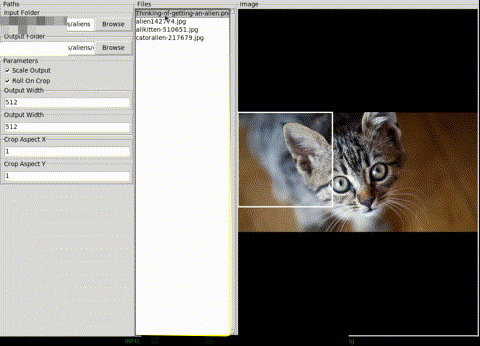

# TOOL-FastBatchImageCrop
A simple UI tool to batch crop images to prepare datasets.

## Features
- Crop images from videos and image folders with custom aspect ratios
- Resize cropped images automatically
- Extract frames from videos
- Crop iamges from videos while playing the video
- Save cropped images to different class folders
- Tag images to txt files while cropping

## Usage

Install requirements (only pillow and opencv) with;

>pip install -r requirements.txt

Run with;

>python main.py

Select input folder, adjust crop rectangle size with mousewheel, click, repeat.

There are options to enter class names and image descriptions per crop. Class name creates seperate directories to save in the output folder and image descriptions create txt files with the same names per image.

Shortcut keys when cursor is on canvas;

    - q: Rotate image CCW
    - e: Rotate image CW
    - r: Toggle roll to next image on crop
    - space: Roll to next image

Hack away.
